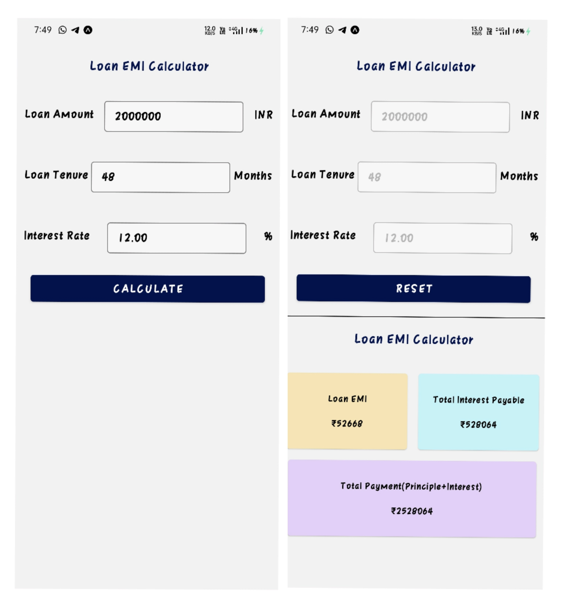

# LoanEmiCalc
Loan calculator will have three input fields-  loan amount tenure in terms of months and, annual interest rate. On submission of this form, output screen will display- EMI, Total Interest Payables and Total Payables. Refer to attached screen &amp; protype to design as per the same.
# Download App
You can download the app using the below link< br/>
https://bit.ly/3EjkOKk
# Screenshots

# Development
This project doesn't require basic react native setup to get up and running.< br/>
Install the expo-sdk and get started. Read more about expo at https://expo.io< br/>
Run the below commands in sequence to start the development server in expo.< br/>
In order to start the development server without expo, read the React Native docs at https://reactnative.dev< br/>
1. git clone https://github.com/Vinaypd7/LoanEmiCalc.git
2. cd RN_Task
3. npm i expo
4. expo install or npm install
5. expo start
